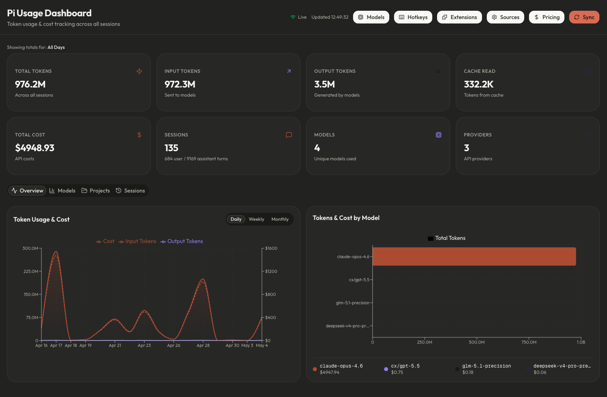

# Pi 用量仪表盘 (Pi Usage Dashboard)

一个基于 Web 的图形化仪表盘，用于追踪和统计 [pi 编程智能体 (pi coding agent)](https://github.com/badlogic/pi-mono) 在所有项目中的 Token 消耗、API 费用、会话记录和全局资源。

  

<p align="center">
  
</p>

## 功能特性

- **用量与费用统计** — 统计所有会话的总 Token 消耗、提示词输入/模型输出拆分、缓存读取/写入用量以及 API 花费。
- **实时同步更新** — 基于 Server-Sent Events (SSE) 和文件变动监听，会话产生变化时仪表盘实时刷新。
- **多数据源合并** — 支持合并多个运行环境的会话（Pi 默认路径、Superconductor、自定义路径等）。
- **模型单约定价** — 支持按模型分别配置每 100 万 Token 的输入/输出/缓存单价，精准核算各提供商费用。
- **多时间维度筛选** — 支持按天 (Daily)、按周 (Weekly)、按月 (Monthly) 筛选统计，图表与统计卡片联动。
- **项目详情与会话列表** — 按项目拆分用量，支持查看各项目全部历史会话并直接在终端打开。
- **会话操作** — 支持在终端中恢复会话 (Resume)、分叉会话 (Fork)、导出为 HTML、通过 Gist 分享或复制会话。
- **模型与提供商管理** — 集中查看已认证的模型、服务提供商、认证状态，并支持添加自定义提供商与模型。
- **扩展与技能管理** — 浏览并管理已安装的扩展 (Extensions)、技能 (Skills)、提示词模板 (Prompts) 和主题 (Themes)。
- **快捷键速查** — 完整的 Pi 键盘快捷键参考列表，清晰标注默认快捷键与自定义覆盖项。
- **跨平台兼容** — 完美支持 Windows、macOS 和 Linux。
- **便捷 CLI 工具** — 提供全局命令 `pi-usage start`、`pi-usage stop`、`pi-usage open` 等，随时随地在终端掌控。

## 快速上手

### 环境要求

- [Node.js](https://nodejs.org/) 20.19+（建议使用当前 LTS）
- 全局安装 [pi coding agent](https://github.com/badlogic/pi-mono)

### 安装步骤

```bash
git clone https://github.com/mralifakbar/pi-usage-dashboard.git
cd pi-usage-dashboard
npm install
npm run build
npm link
```

### CLI 命令行使用

执行 `npm link` 之后，即可在全局终端使用 `pi-usage` 命令：

```bash
pi-usage start          # 在后台启动仪表盘
pi-usage stop           # 停止运行中的仪表盘
pi-usage restart        # 重启仪表盘
pi-usage status         # 检查运行状态（显示 PID 与访问 URL）
pi-usage open           # 在浏览器中打开（未启动会自动启动）
pi-usage update         # 拉取最新代码 + 安装依赖 + 重新构建 + 重启
pi-usage dev            # 以开发模式在前台运行（支持热重载）
pi-usage build          # 重新编译生产环境产物
pi-usage port <端口号>  # 更改运行端口 (默认: 33123)
pi-usage logs           # 查看最近 50 行日志
pi-usage help           # 显示全部命令帮助
```

### 不使用 CLI 直接运行

也可以直接通过 npm 脚本启动：

```bash
npm run start           # 生产模式启动（端口 33123）
npm run dev             # 开发模式启动
```

启动后在浏览器中访问：[http://localhost:33123](http://localhost:33123)。

## 配置说明

### 供应商额度

首页显示 OpenAI Codex 的短周期 / 周额度，以及 Antigravity 返回的各模型剩余比例和重置时间。模型列表可展开；比例不是 Token 或请求次数，模型间可能共享额度，不推测接口未返回的周额度。

- 只读本机 `~/.pi/agent/auth.json` 中 `openai-codex`、`antigravity` 的 OAuth 登录态，不需要接入 9router。
- 不刷新或修改登录凭据；过期时需在 Pi 中刷新登录，再点击“刷新额度”。凭据不会发给浏览器。
- 自动刷新间隔 5 分钟，手动刷新最短间隔 15 秒；查询失败保留并标记上次成功数据。
- 出站查询支持启动进程的 `HTTPS_PROXY`、`HTTP_PROXY`、`NO_PROXY` 环境变量。代理设置变化后需重启仪表盘。
- 额度接口可能独立限流或拒绝访问，不代表模型调用不可用。

接口语义参考 [9router Codex](https://github.com/decolua/9router/blob/master/open-sse/services/usage/codex.js) 与 [Antigravity](https://github.com/decolua/9router/blob/master/open-sse/services/usage/google.js)。

### 会话数据源 (Session Sources)

仪表盘默认会自动读取 Pi 的标准会话存储目录（`~/.pi/agent/sessions/`）。

若你使用了其他集成工具，可以在仪表盘界面的 **数据源 (Sources)** 页面（`/settings`）添加附加路径：

- **Superconductor**: `~/.superconductor/sessions/pi/`
- **自定义封装 / 工具路径**: 例如 `/path/to/my/agent/sessions/`

仪表盘会自动递归扫描该目录下的 `.jsonl` 文件，并基于会话 ID 自动去重。

### 修改端口

默认端口为 `33123`。你可以通过 CLI 随时修改：

```bash
pi-usage port 8080
pi-usage restart
```

或者手动修改 `package.json` 中的 scripts 脚本。

## 页面路由

| 路由 | 说明 |
|------|------|
| `/` | 仪表盘主页 — 统计卡片、时间趋势图、模型分布图、各项目明细、全部会话列表 |
| `/models` | 模型与提供商管理 — 显示所有模型、提供商以及 `auth.json` 认证状态，支持添加自定义模型；眼睛图标可纳入/排除 Pi 的模型选择范围（`enabledModels`）。范围非硬禁用：被排除模型在 Pi“全部模型”列表中仍可见，重启 Pi 进程后生效，项目级/`--models` 可覆盖 |
| `/hotkeys` | 快捷键参考 — 展示默认快捷键与自定义键位映射 |
| `/extensions` | 扩展与技能 — 浏览已安装的扩展、技能、提示词模板与主题（支持删除操作） |
| `/settings` | 数据源设置 — 配置附加的会话日志扫描目录 |
| `/pricing` | 模型定价 — 为各模型配置每百万 Token 的单价，精准核算花费 |
| `/project?path=...` | 项目详情 — 针对单个项目的用量明细、会话列表及一键在终端恢复会话 |

## API 接口

| 接口 | 方法 | 说明 |
|------|------|------|
| `/api/usage` | GET | 获取所有数据源聚合后的用量数据 |
| `/api/usage/stream` | GET | SSE 实时数据流，文件发生变化时即时推送 |
| `/api/pricing` | GET/POST/DELETE | 模型定价的增删改查 |
| `/api/sources` | GET/POST/PUT/DELETE | 会话数据源目录管理 |
| `/api/models` | GET/POST/PUT/DELETE | 模型与提供商管理；PUT `action=set-model-scope` 纳入/排除模型选择范围，`action=reset-model-scope` 移除 `enabledModels` 限制 |
| `/api/extensions` | GET/DELETE | 获取及删除扩展、技能、提示词和主题 |
| `/api/hotkeys` | GET | 获取键盘快捷键与自定义覆盖项 |
| `/api/terminal` | POST | 在新终端窗口中唤起并打开 Pi（支持跨平台） |
| `/api/session-actions` | POST | 会话的导出、分享或复制 |

## 数据存储位置

| 文件 / 目录 | 作用说明 |
|-------------|----------|
| `~/.pi/agent/usage-dashboard.db` | SQLite 数据库 — 存储定价配置与数据源路径 |
| `~/.pi/agent/usage-dashboard.pid` | 后台进程 PID 记录文件 |
| `~/.pi/agent/usage-dashboard.log` | 仪表盘运行日志文件 |
| `~/.pi/agent/sessions/` | 默认 Pi 会话存储目录（只读读取） |
| `~/.pi/agent/auth.json` | OAuth 及 API 凭据配置（只读读取） |
| `~/.pi/agent/models.json` | 自定义提供商与模型配置（读写） |
| `~/.pi/agent/settings.json` | 仅读写其中的 `enabledModels` 字段（模型选择范围），原子保存 |
| `~/.pi/agent/keybindings.json` | 自定义键盘快捷键配置（只读读取） |

## 工作原理

### 会话解析机制

Pi 将会话以树状结构的 JSONL 文件保存。每条助手回复消息中都包含 `usage` 字段记录 Token 数量。仪表盘工作流程如下：

1. 递归扫描所有已启用的会话源目录，查找所有 `.jsonl` 文件；
2. 解析每个会话文件，提取包含用量数据的助手消息；
3. 匹配对应的模型定价规则（若已配置），核算总费用；
4. 跨所有数据源按会话 ID 自动去重；
5. 按模型、项目、按天、按周以及按月进行多维度聚合统计。

### 实时更新机制 (SSE)

采用 Server-Sent Events (SSE) 搭配 [chokidar](https://github.com/paulmillr/chokidar) 进行文件系统监听：

- 实时监听所有启用的数据源目录中的 `.jsonl` 文件变动；
- 设置 1 秒防抖（debounce），避免在会话进行中频繁刷新；
- 连接断开时自动重试重连（3 秒重试间隔）；
- 每 30 秒发送心跳包保持长连接活跃；
- 在主界面点击“同步数据”可随时重新同步并加载新增数据源。

### 压缩安全性 (Compaction Safety)

Pi 内置的上下文压缩功能会对旧消息进行摘要归纳，但**绝不会从 JSONL 文件中删除原始消息**。因此，无论是否触发过压缩，所有历史 Token 消耗均会被完整保留并精确统计。

### 跨平台终端唤起

终端唤起 API 会自动识别操作系统并采用原生适配命令：

| 操作系统 | 唤起方式 |
|----------|----------|
| macOS | `osascript` → 唤起 Terminal.app |
| Linux | `gnome-terminal`、`konsole`、`xterm` 或 `x-terminal-emulator` |
| Windows | `start cmd /k` |

## 开源协议

本项目基于 [MIT 协议](LICENSE) 开源。
